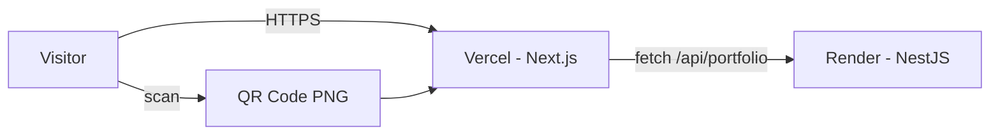

# Portfolio — Ouassim Hammadi

A full-stack portfolio website built with **Next.js** (frontend) and **NestJS** (backend), structured as an npm workspaces monorepo.

## Structure

```
portfolio/
├── apps/
│   ├── api/          # NestJS REST API serving portfolio data
│   └── web/          # Next.js App Router frontend
├── package.json      # Root workspace scripts
└── README.md
```

## Prerequisites

- Node.js 20+
- npm 10+

## Setup

1. Install dependencies from the repo root:

```bash
npm install
```

2. Copy environment files:

```bash
cp apps/api/.env.example apps/api/.env
cp apps/web/.env.example apps/web/.env.local
```

## Development

Run both frontend and backend concurrently:

```bash
npm run dev
```

Or run them separately:

```bash
# Backend (http://localhost:3001)
npm run dev:api

# Frontend (http://localhost:3000)
npm run dev:web
```

## Production Build

```bash
npm run build
```

Start production servers:

```bash
npm run start:api   # NestJS on port 3001
npm run start:web   # Next.js on port 3000
```

## API Endpoints

| Endpoint | Description |
|---|---|
| `GET /api/portfolio` | Full portfolio data |
| `GET /api/portfolio/profile` | Name, title, summary, contact |
| `GET /api/portfolio/skills` | Skills grouped by category |
| `GET /api/portfolio/experience` | Work experience |
| `GET /api/portfolio/projects` | All projects (experience + standalone) |
| `GET /api/portfolio/education` | Education and training |
| `GET /api/portfolio/contact` | Contact information |

## Environment Variables

**API (`apps/api/.env`)**

| Variable | Default | Description |
|---|---|---|
| `PORT` | `3001` | API server port |
| `CORS_ORIGIN` | `http://localhost:3000` | Allowed frontend origin |

**Web (`apps/web/.env.local`)**

| Variable | Default | Description |
|---|---|---|
| `NEXT_PUBLIC_API_URL` | `http://localhost:3001` | Backend API base URL |
| `NEXT_PUBLIC_SITE_URL` | `http://localhost:3000` | Public site URL (Open Graph, QR regeneration) |

## Tech Stack

- **Frontend:** Next.js 15, React 19, Tailwind CSS 4, TypeScript
- **Backend:** NestJS 11, TypeScript
- **Monorepo:** npm workspaces

## Content

All portfolio content is sourced from the CV and served via the NestJS API. To update content, edit `apps/api/src/portfolio/portfolio.data.ts`.

## Deployment

Architecture: **Vercel** (Next.js frontend) + **Render** (NestJS API). Free tier on both platforms.



### 1. Push to GitHub

```bash
git add .
git commit -m "Prepare portfolio for deployment"
git remote add origin <your-github-repo-url>
git push -u origin main
```

### 2. Deploy API on Render

1. Go to [render.com](https://render.com) → **New** → **Web Service**
2. Connect your GitHub repository
3. Use these settings (or apply the blueprint from [`render.yaml`](render.yaml)):
   - **Name:** `portfolio-api`
   - **Root Directory:** `apps/api`
   - **Runtime:** Node
   - **Build Command:** `cd ../.. && npm install && npm run build --workspace=apps/api`
   - **Start Command:** `npm run start:prod`
4. Add environment variables:
   - `PORT` = `3001`
   - `CORS_ORIGIN` = `https://your-app.vercel.app` (set after Vercel deploy)
5. Deploy and note the API URL, e.g. `https://portfolio-api-xxxx.onrender.com`

**Note:** Render free tier sleeps after ~15 minutes of inactivity. The first request after idle may take 30–60 seconds.

### 3. Deploy frontend on Vercel

1. Go to [vercel.com](https://vercel.com) → **Import** your GitHub repository
2. Settings:
   - **Framework Preset:** Next.js
   - **Root Directory:** `apps/web`
3. Add environment variables:
   - `NEXT_PUBLIC_API_URL` = `https://portfolio-api-xxxx.onrender.com`
   - `NEXT_PUBLIC_SITE_URL` = `https://your-app.vercel.app`
4. Deploy and note the frontend URL

### 4. Update CORS and redeploy

On Render, set `CORS_ORIGIN` to your Vercel URL and trigger a redeploy of the API.

### 5. Verify production

```bash
WEB_URL=https://your-app.vercel.app API_URL=https://portfolio-api-xxxx.onrender.com npm run verify:production
```

### 6. Custom domain (optional, later)

1. **Vercel:** Project Settings → Domains → add your domain and follow DNS instructions
2. **Render:** Custom Domains → add `api.yourdomain.com` (optional)
3. Update env vars on both platforms and redeploy
4. Regenerate the QR code (see below)

## QR Code

The contact section displays a QR code (`/qr-code.png`) that links to your live portfolio URL.

### Generate or update

After deployment (or when your domain changes):

```bash
PORTFOLIO_URL=https://your-app.vercel.app npm run generate:qr
git add apps/web/public/qr-code.png
git commit -m "Update portfolio QR code"
git push
```

For local development, use your local URL:

```bash
PORTFOLIO_URL=http://localhost:3000 npm run generate:qr
```

The QR image is stored at `apps/web/public/qr-code.png` and served statically by Next.js.
